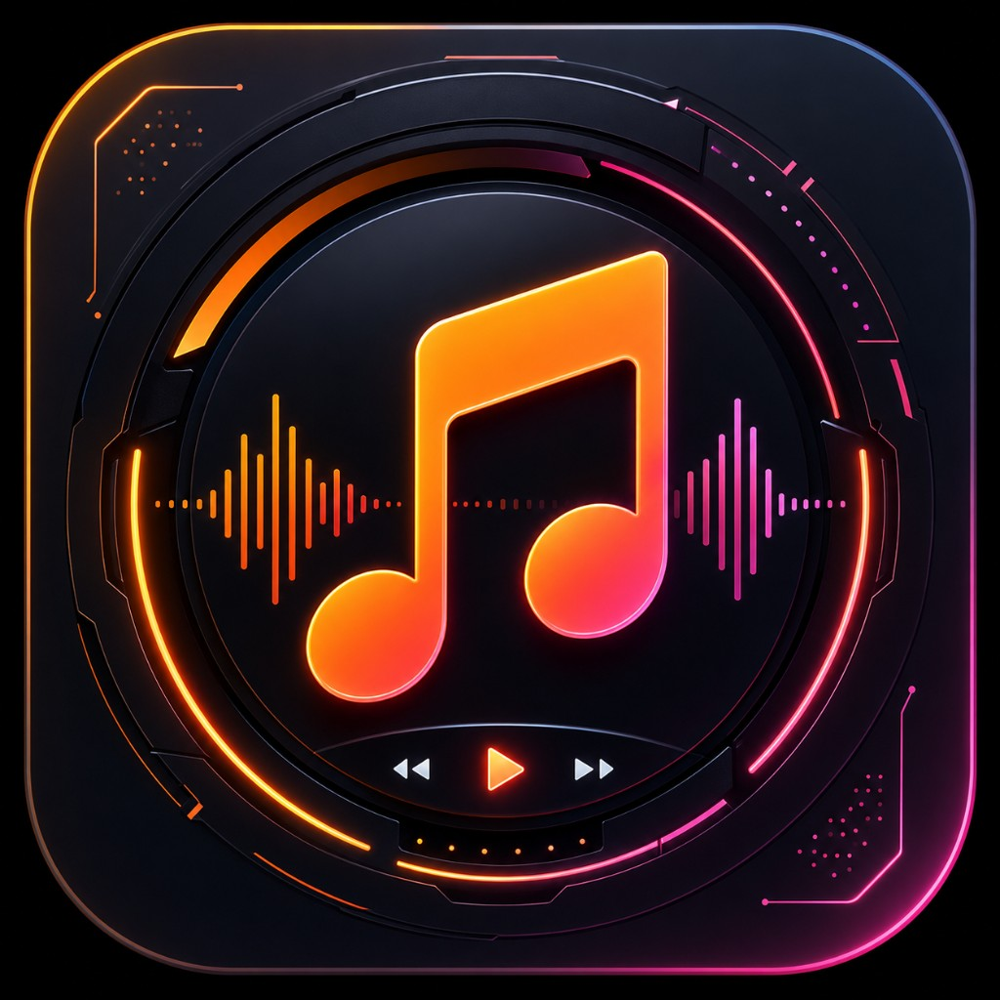

<p align="center">
  
</p>

<h1 align="center">Harmonic</h1>

<p align="center">
  <strong>Offline-first music player for Android</strong><br />
  Your library stays on your device. No accounts. No streaming. No cloud.
</p>

<p align="center">
  
  
  
  
</p>

<p align="center">
  
  
  
  
  
</p>

---

## About

Harmonic is a personal offline music player built with **Expo** and **React Native**. It scans local audio on your phone, caches metadata in SQLite, and plays in the background with notification and lock-screen controls.

Perfect if you want a clean local library experience without accounts or the cloud.

---

## Features

| | Feature | Details |
| :---: | --- | --- |
| 🎵 | **Local library scan** | Reads audio files already on the phone |
| 🔒 | **Background playback** | Notification and lock-screen controls |
| 📚 | **Browse everything** | Songs, artists, albums, playlists, favorites |
| 🔍 | **Search and sort** | Find tracks fast, order the library your way |
| 🎧 | **Now playing** | Full-screen player plus a persistent mini player |
| 🎨 | **Themes** | Light / dark / system, accents, and density |
| 📴 | **Fully offline** | SQLite + MMKV - nothing leaves the device |

---

## Tech stack

<p align="center">
  
  
  
  
  
  
  
  
</p>

| Layer | Choice |
| --- | --- |
| App framework | Expo SDK 57 + React Native (New Architecture) |
| Navigation | React Navigation (tabs + native stack) |
| Playback | `@rntp/player` (background / media session) |
| Library scan | `expo-media-library` + `@nodefinity/react-native-music-library` |
| Storage | `expo-sqlite`, `react-native-mmkv` |
| State | Zustand |
| UI | Reanimated, FlashList, custom theme tokens |

---

## Requirements

- Node.js 20+
- Android device or emulator (API 24+)
- Android Studio / SDK for native builds
- Expo CLI via `npx` (no global install required)

> **Note:** Harmonic uses a **development build** (`expo-dev-client`), not Expo Go - native modules need a custom binary.

---

## Getting started

```bash
# Install dependencies
npm install

# Generate the Android native project
npx expo prebuild --platform android

# Build and run on a connected device / emulator
npx expo run:android --device
```

### Scripts

| Script | Command | Description |
| --- | --- | --- |
| Start Metro | `npm start` | Dev client bundler |
| Run Android | `npm run android` | Build and launch on device |
| Typecheck | `npm run typecheck` | Run TypeScript checks |

---

## Project structure

```
src/
  components/     Shared UI (SongRow, MiniPlayer, sheets, ...)
  database/       SQLite schema and queries
  navigation/     Tab and stack navigators
  screens/
    library/      Songs, artists, albums, playlists
    player/       Now Playing modal
    settings/     Theme, accent, density
  services/
    audio/        Player and playback service
    musicScanner/
    permissions/
  store/          Zustand stores + MMKV
  theme/          Colors, accents, ThemeProvider
  types/
  utils/
```

---

## Permissions (Android)

| Permission | Why |
| --- | --- |
| `READ_MEDIA_AUDIO` / storage | Scan and play local music |
| `POST_NOTIFICATIONS` | Playback controls in the notification shade |
| `FOREGROUND_SERVICE` / media playback | Keep audio running in the background |
| `WAKE_LOCK` | Reliable playback while the screen is off |

---

## Manual test checklist

- [ ] Grant music access when prompted
- [ ] Confirm songs appear after a library scan
- [ ] Play a track, then minimize the app - audio should continue
- [ ] Use notification / lock-screen play, pause, next, and previous
- [ ] Favorite a song, create a playlist, and change theme or accent in Settings

---

## License

Released under the [MIT License](./LICENSE).